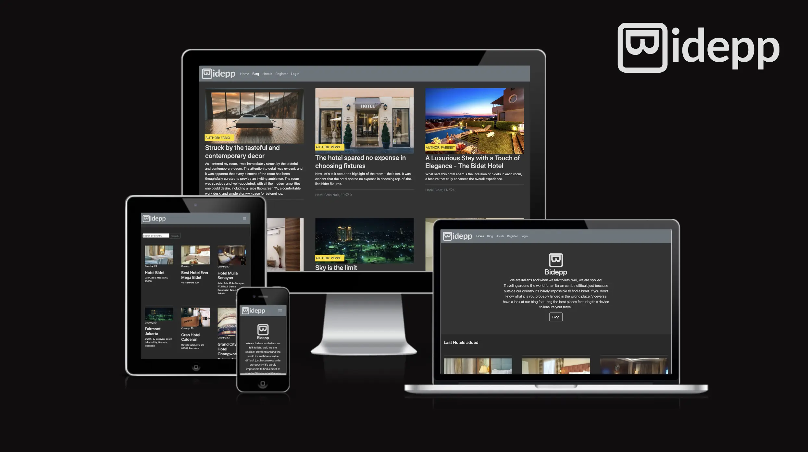
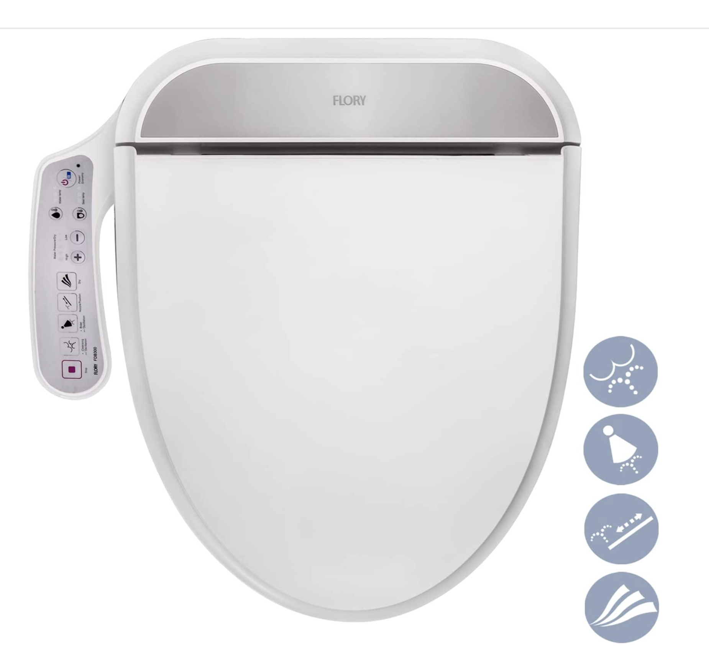
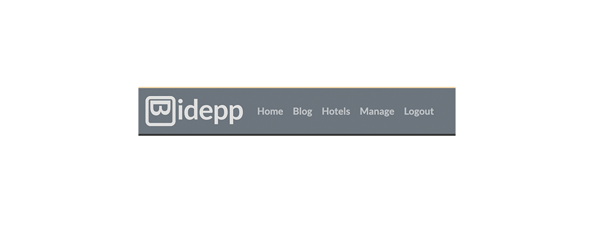
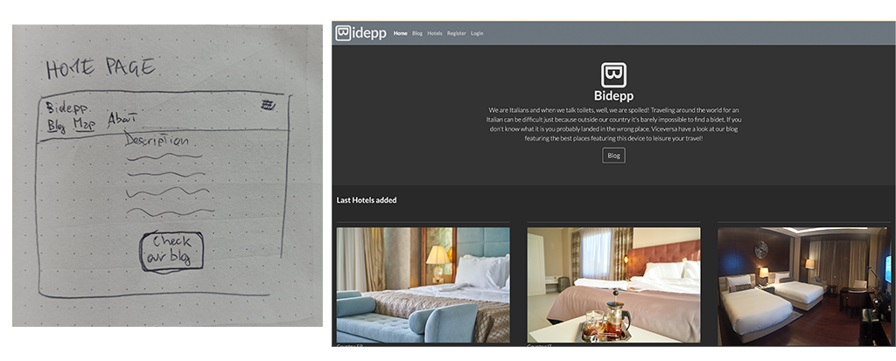
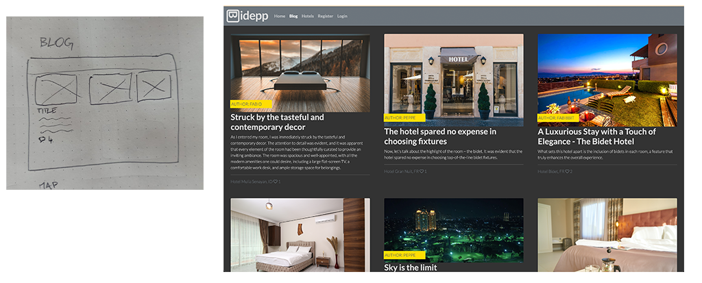
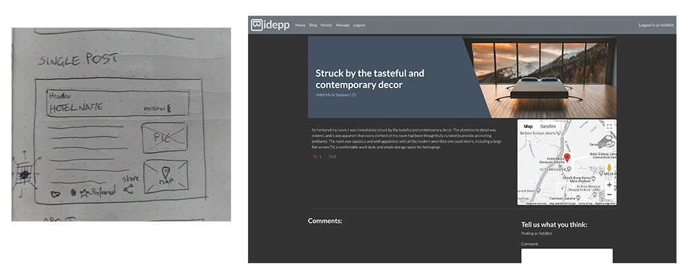
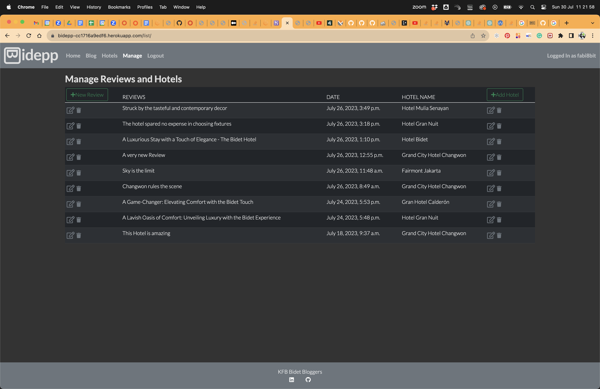

# Bidepp



Bidepp is a full stack blog website. It's built using Django, Python, HTML, CSS and JavaScript. This project was created as my fourth portfolio project for my Diploma in Web Application Development at Code Institute.

[Visit Bidepp blog Here](https:)


---

## Contents

* [The Idea](#the-idea)
* [Project Goal](#project-goal)

* [Project Planning](#project-goal)
  * [Sketches](#sketches)
  * [Feature Planning](#feature-planning)
  * [User Stories](#user-stories)
  * [Database Scheme](#database-scheme)
  * [Wireframes](#wireframes)

* [Design](#design)
  * [Logo](#logo)
  * [Colors and Typografy](#colors-and-typografy)
  * [Wireframes and actual pages](#wireframes-and-actual-pages)

* [General features](#general-features)
  * [Navigation bar](#navigation-bar)
  * [Guest and Registered User](#guest-and-registered-user)
  * [Superuser and defensive programming](#superuser-and-defensive-programming)

* [Future development and ideas](#future-development-and-ideas)

* [Accessibility](#accessibility)

* [Testing](#testing)

* [Local Development & Deployment](#local-development-&-deployment)

* [Technology used](#technology-used)

* [Credits](#credits)

    

---

## The Idea

My brother and I are used to traveling. As Italians sometimes we struggle not finding a Hotel room with a bidet, and this is something really common when you travel abroad. From this need the idea of Bidepp was born: "a Hotel directory only for Hotels with bidets"

## Project Goal

The website is a blog reviewing Hotels around the world that feature a bidet. It aspires to become the place to go before booking hotel room abroad. Besides the blog section, the website has a directory where all the reviewed Hotels are listed.
In the future a direct booking system will be implemented.


## Project Planning
### *Sketches*
For the planning of this project I took inspiration from the walkthrough project "I think therefore I blog" of Code Institute. I adapted some of the features to my needs and integrated them with some codes I learned during the lessons. Check the end of the document for the credits.
Before I dove into coding I sketched roughly some ideas on paper, and wrote down some notes. That helped me to keep track of the project and stay focused on the steps to take.


---
### *Feature Planning*

|User Type | Feature |  Delivered |
| :--- | :--- | :---: | 
| User | Sign up for an account | yes |
| User | See the list of reviews | yes |
| User | Read the detailed reviews | yes |
| User | Read the comments on the review | yes |
| Registered User | Comment on reviews | yes |
| User | See number of likes | yes |
| Registered User | Like reviews | yes |
| User | See the list of hotels | yes |
| User | See the hotels details | yes |
| User | See all the featured hotels on a map | no |
| User | See the location of the hotels on a map | yes |
| Registered User | Set Hotel as preferred | no |

---
---
### *User Stories*

After defining the feature for the blog I lined up the user stories as follows:

| User Story ID | Title | As a/an | I can | So that |
| :--- | :--- | :--- | :--- | :--- |
| 1 | Site presentation | User | read what the site is all about | I understand what type of Information it's providing |
| 2 | Sign UP | User | register an account | I can comment and like reviews |
| 3 | Preferences | User | Like or Unlike reviews | I can express my preferences |
| 4 | Comments on Reviews| User | leave my comments | other users can read my opinion |
| 5 | Open reviews | User | click on a post | I can read the full review |
| 6 | Read the reviews | User | view the blog | I can read the reviews |
| 7 | View likes | User | view the number of likes | I understand which is the most popular review |
| 8 | View comments | User | read comments on a single review | I understand what other people think |
| 9 | Write Reviews | Admin | create, read, update, delete Reviews | I have complete controll on the blog |
| 10 | Approve comment | Admin | approve or disapprove comments on my reviews | I can moderate my blog |
| 11 | Draft reviews | Admin | save my reviews as draft | I can keep working on them in the future |
| 12 | Reviews list | User | view a list of reviews | I can decide which one to click |
| 13 | Number of comments | User | view the number of comments on a single post | I can understand the level of engagement on a single post |
| 14 | Sharing | User | share a review | someone else can read the review |
| 15 | Hotel location | User | On a map I can see the Hotel location | I know where it is |
| 16 | Location Cluster | User | click a marker on the map | I can be redirected to the review of the specific Hotel |
| 17 | Create Hotel | Admin | create, read, update, delete Hotels | I can attach them to a Review |

---
---
### *Database Scheme*
For the database model I took complete inspiration from the model used for the walkthrough project "I think therefore I blog" of Code Institute.
While designing the draft for the Review model I realized I needed a different table for the Hotels in order to separate completely the Hotel from the Post, so I could add more functionality to the the App, like grouping and displaying Hotels by country, and retrieve after the relative reviews. From the picture below you can see the draft I initially designed with some strikethrough lines which are the ones I decided to move to the Hotel model. During the develope I further edited the model for the Hotels. I added Hotel_image and created_on fields. Thanks to the agile methodology, it was very easy to adapt what was planned at the beginning.


#### Hotel Model
For the Hotel model I installed an external library called django-countries.It provides a country field for Django models and the informations can be found [here](https://pypi.org/project/django-countries/).


#### Review Model


#### Comment Model


---
---
## Design

### *Logo*
The logo was designed by me using Adobe Illustrator. I was inspired by the button signs you can find on some special toilet seats largely diffused in Korea, Indonesia, and Japan.

It was very easy to flip by 90 degrees the B of the name Bidepp and get an elegant little butt!


### *Colors and Typografy*
For the colors and typography I decided to use a minimalistic style in order to enhance the overall readability. The website is based on a high contrast gray scale with whiteish text. The font used is Lato and it's taken from google-font in 2 weights (300 and 700). The weight 300 is used mainly for the paragraphs while the 700 is mostly used for all the range of the 'h' elements.
 


### *Wireframes and actual pages*

* Base Template: It contains the header and the footer of the whole site. The content of the other pages is injected into this template using the template tags


* Index: it's the Home page of the site. It contains a brief explanation Bidepp and a button to access the blog. At the bottom it features a paginated list of the 3 most recent Hotels added to the database. The elements are clickable and they are linked to the detail view of the specific Hotel


* Reviews: In this page are listed all the reviews from the most recent to the oldest. All the elements are clickable and linked to the specific review. For UX reasons the posts are paginated by 6 reviews. If there are more than 6 reviews, a clickable arrow will appear at the bottom of the section to access the next reviews.


* Hotels: This is the list of all the Hotels reviewed in the blog. The same logic as the reviews is applied here. There is a search bar where the user can type in the nation in order to display all the reviewed hotels available for this nation.

* Clicking on one of the element will show the details for the post


* Register: A user can register an account here. A registered user can comment and like the posts.


* Login: If an account is already registered, a user can log in from this page.


* Manage: This link is only visible if a User is logged in as Superuser. On this page are listed all the reviews and from here it is possible to operate all the CRUD functionality. On the top left corner there's a button to create a new review, while beside every listed review (on the left side) are displayed an edit button and a trash can button which are respectively used to edit and delete the reviews. On the top right corner there is another button to add new hotels to be reviewed. Beside the hotel name (right side) are displayed the same button as for the Reviews, but this time they are for editing and deleting the hotels. Deleting the Hotels will result on a cascade deletion of the related reviews.



## General features
### Navigation bar
Active link highlight:
In order to highlight the links in the navigation bar, I created a specific context in views.py, to be passed to the specific template. For the generic views I referred to [this video](https://www.youtube.com/watch?v=aGnVZwp47do)

### Guest and Registered User
Bidepp is a classic blog website that features a log in page. A logged user has the ability to comment on reviews or express preferences through the like button. 
For comments I used django-crispy-forms. By default, in the template, I didn'like the label of Body and with a little bit of research I found how to tweak it. I also didn't like the use of * (asterisk) to denote a required field for comments. In the documentation I found out that the asterisks have an asteriskField class set. So I could hide it using display: none  in the CSS file.
Comments and overall likes are still visible to the guest users who are not logged in.
The guest users can also see the reviews list and hotels list as well as the details for reviews and hotels.
Both the Review detail and Hotel detail feature a map that show the exact position of the Hotel. The coordinates are stored in the database at the moment of the Hotel creation. The map is displayed on the page using the Google Maps API. At this stage the Map functionality is still very rudimental, but it is something I would like to develop in the future.


### Superuser and defensive programming
The admin or superuser has special privileges. When logged in as superuser the manage menu appears in the top navbar. Through this page it is possible to create new reviews, add new hotels, edit already existing reviews and hotels and delete them.
Defensive programming has been used for the management of this section to prevent unauthorized users to access restricted functionalities like writing reviews. This has been accomplished through the permission check in class-based views:
I used a Django built-in class named UserPassesTestMixin to ensure that only users that pass a permission test are allowed to access the class-based view.


## Future development and ideas
- The 403, and 404 http response is not handled due to time constraints (deadline is in a few hours!!!), but it's planned to build a specific html page to display this response.

- A registered user can give preferences for the hotels and have them listed inside a private page.

- Cluster Map: Display on a map of all the hotels reviewed. Hovering over a marker with the mouse will give all the information about the specific hotel

- Integrated Booking system

- Password management for registered users

- Send newsletters to users


## Accessibility

- Use of semantic HTML
- Alt attributes for screen readers used on all the images of the site
- Great color contrast between background and text


## Testing
Refer to this document [TESTING.md](TESTING.md)


## Local Development & Deployment

### Django installation and supporting Library

In the requirements.txt file are listed all the dependencies needed to run the project.

#### **Live Database**
It's also needed to register an account at [ElephantSQL](https://www.elephantsql.com/) for the external database

#### **Create Heroku App**
Create a new app in heroku giving a unique name

#### **Attach the database**
Copy the url from the new database created at [ElephantSQL](https://www.elephantsql.com/)

#### **Prepare environment and settings.py
Create the env.py file inside your project workspace and make sure it is listed inside the gitignore.
Type the following code:
```
import os
os.environ["DATABASE_URL"]="<copiedURLfromElephantSQL>"
os.environ["SECRET_KEY"]="my_super^secret@key"
```

and save the file.

In the settings.py below the path import type this code:
```
 import os
 import dj_database_url
 if os.path.isfile('env.py'):
     import env
```

Remove the insecure secret key provided by django and type this code:
```
SECRET_KEY = os.environ.get('SECRET_KEY')
```

In the DATABASE section comment out the original code and type as follow:
```
 # DATABASES = {
 #     'default': {
 #         'ENGINE': 'django.db.backends.sqlite3',
 #         'NAME': BASE_DIR / 'db.sqlite3',
 #     }
 # }
    
 DATABASES = {
     'default': dj_database_url.parse(os.environ.get("DATABASE_URL"))
 }
```

Save your files and run the migration command in your terminal:
```
python manage.py migrate
```

Connect the new database to Heroku. Head to the dashboard inside Heroku and under settings reveal the config vars. Add the following vars:
```
key: DATABASE_URL Value: ElephantSQL url
key: SECRET-KEY Value: Your secret key

```

#### Get static and media files stored on Cloudinary

- Create an account at [cloudinary.com](https://cloudinary.com/)
- Copy the API environment variable
- inside the env.py add this code:
```
os.environ["CLOUDINARY_URL"] = "your API environment variable"
```

- back to Heroku add the same var in the config var
- inside Heroku add also
```
key: DISABLE_COLLECTSTATIC value: 1
```
this variable will be removed before the final deployment

- Add Heroku app to the allowed host in settings.py:
```
ALLOWED_HOSTS = [
    'bidepp-cc1716a9edf6.herokuapp.com',
    '8000-fabi8bit-bideppfspp4-5aqbgymdmss.ws-eu102.gitpod.io']
```

- set the DEBUG value to False in settings.py:
```
DEBUG = False
```
- Save the files, add, commit, and push to github

- Head to Heroku dashboard. Under deploy, use GitHub as deployment method. In the github searchbar look for the repo and connect. Head down to the Manual deploy section and deploy branch from main

## Technology used
#### Languages
HTML, CSS, Python, Javascript

#### Database
ElephantSQL

#### Frameworks
Django 3.2, Bootstrap4

#### Libraries
- Cloudinary
- Crispy-forms
- dj-database
- django-allauth
- django-summernote
- gunicorn
- psycopg2
- pyuca

#### Software used
- Google dev tools
- Git
- GitHub
- Adobe Illustrator
- Adobe Photoshop


## Credits

This project is based on the walkthrough projects from Code Institute called "I think therefore I blog" and "Hello Django".  

This readme file is inspired by a talented former student @ Code Institute [Kera Cudmore](https://github.com/kera-cudmore). I don't know her personally but for me she is a model to follow as a programmer.  

I took also inspiration from many resources that I'll list here:

- defensive design
https://www.webforefront.com/django/permissionchecks.html

- Case sensitive username field (not used)
https://simpleisbetterthancomplex.com/article/2021/07/08/what-you-should-know-about-the-django-user-model.html

- Django countries - implement the dropdown menu for the countries in the manage page for Reviews and Hotels
https://pypi.org/project/django-countries/

- Display the Hotels positions:
https://stackoverflow.com/questions/73049566/trying-to-get-a-google-maps-to-display-in-django

- django: how to pass template variable to javascript onclick routine.
Used to pass coordinates for the map.js function
https://stackoverflow.com/questions/28516101/django-how-to-pass-template-variable-to-javascript-onclick-routine

- Form creation  
  https://medium.com/jungletronics/a-django-blog-in-vs-code-3b6fc8eb19aa  

  https://www.javatpoint.com/django-crud-application  

  https://forum.djangoproject.com/t/how-to-restrict-django-staff-user-to-edit-or-delete-others-staff-user-post-from-admin-panel/7887  

  https://www.youtube.com/watch?v=TAH01Iy5AuE

- CRUD functionality  
https://www.youtube.com/watch?v=N6jzspc2kds&t=3387s  


TESTING

httpResponseRedirect didnt work. So I tried with JS

The Review and Hotel managing panel, at this stage, is able to display only the Published review and the Hotels associated with it (all the reviews and hotels are accessible from the admin page). In order to retrieve the data for all the reviews, I decided to use the same class as for the blog. A possible solution is to duplicate the class and delete the filter in order to display both the draft and published reviews.
Hotels are only visible when associated to a review because it's a blog reviewing Hotels and not an Hotels directory.

The slug field in the new Review form is not automatic and has to be generated manually. It's fully automatic in the admin page. A possible solution is to implement a javascript I found at [this link](https://gist.github.com/codeguy/6684588) or [this link](https://stackoverflow.com/questions/12098319/how-add-a-pre-populated-field-to-a-form-submission-in-django-like-in-admin)

- Deleting Reviews not working until I moved the order of the urls path
- Deleting Hotel not working until I moved the order of the urls path
- After the second time I moved the path order in the urls I researched and found this 


-

defensive design
https://www.webforefront.com/django/permissionchecks.html

Case sensitive username field
https://simpleisbetterthancomplex.com/article/2021/07/08/what-you-should-know-about-the-django-user-model.html

Django countries
https://pypi.org/project/django-countries/

Widget Tweaks
https://www.geeksforgeeks.org/how-to-customize-django-forms-using-django-widget-tweaks/

external resources:
location map https://django-geoposition.readthedocs.io/en/latest/

I found this simple solution that I like to display the Hotel positions:
https://stackoverflow.com/questions/73049566/trying-to-get-a-google-maps-to-display-in-django

many to one relationship in django
https://docs.djangoproject.com/en/4.2/topics/db/examples/many_to_one/


Google Maps marker as a link:
https://stackoverflow.com/questions/3056213/google-maps-marker-as-a-link

Google Maps Tutorial and API KEY config
https://www.youtube.com/watch?v=CdDXbvBFXLY

SetUp Google Maps (google tutorial)
https://developers.google.com/maps/documentation/javascript/adding-a-google-map#maps_add_map-html

Map IDs and custom maps
https://developers.google.com/maps/documentation/get-map-id

Use the Google Maps API to build a custom map with markers
https://www.youtube.com/watch?v=CdDXbvBFXLY

idea for hotel page
http://www.prepbootstrap.com/bootstrap-template/real-estate-list-map-dynamic

django: how to pass template variable to javascript onclick routine
https://stackoverflow.com/questions/28516101/django-how-to-pass-template-variable-to-javascript-onclick-routine

form creation
https://medium.com/jungletronics/a-django-blog-in-vs-code-3b6fc8eb19aa
https://www.javatpoint.com/django-crud-application
https://www.youtube.com/watch?v=N6jzspc2kds&t=3387s  i used this tutorial to implement the crud functionality
https://forum.djangoproject.com/t/how-to-restrict-django-staff-user-to-edit-or-delete-others-staff-user-post-from-admin-panel/7887
https://www.youtube.com/watch?v=TAH01Iy5AuE

search bar
https://www.youtube.com/watch?v=AGtae4L5BbI

https://stackoverflow.com/questions/59678466/return-dictionary-from-generic-list-view

Active link highlight:
In order to highlight the links in the navigation bar, I created a specific context in views.py, to be passed to the specific template. For the generic views I refered to [this video](https://www.youtube.com/watch?v=aGnVZwp47do)


