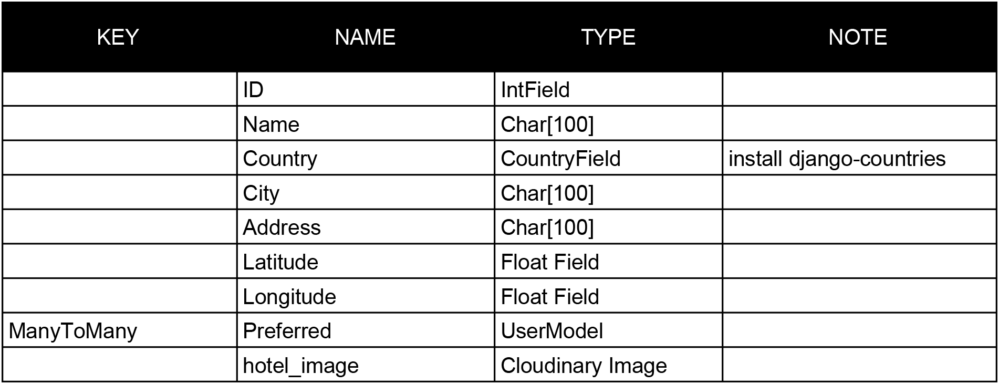

# Bidepp

Bidepp is a full stack blog website. It's built using Django, Python, HTML, CSS and JavaScript. This project was created as my fourth portfolio project for my Diploma in Web Application Development at Code Institute.

[Visit Bidepp blog Here](https:)

---

## Contents

* [The Idea](#the-idea)
* [Project Goal](#project-goal)

* [Project Planning](#project-goal)
  * [Sketches](#sketches)
  * [Feature Planning](#feature-planning)
  * [User Stories](#user-stories)
  * [Database Scheme](#database-scheme)
  * [Wireframes](#wireframes)

    

---

## The Idea

My brother and I are use to travel. As Italians sometimes we struggle not finding an Hotel room with a bidet, and this is something really common when you travel abroad. From this need the idea of Bidepp was born: "an Hotel directory only for Hotels with bidets"

## Project Goal

The website is a blog reviewing Hotels around the world that feature a bidet. It hope to become the place to go before booking hotel rooms abroad. Beside the blog section, the website has a directory where all the reviewed Hotels are listed.
In the future a direct booking system will be implemented.

## Project Planning
### *Sketches*
For the planning of this project I took inspiration from the walkthrough project "I think therefore I blog" of Code Institute. I adapted some of the features to my needs and integrate with some codes I learned during the lessons. Check at the end of the document for the credits.
Before dove into coding I sketched roughly some ideas on paper and wrote down some notes. That helped me to keep track on the project and stay focused on the steps to take.

---
### *Feature Planning*

|User Type | Feature |  Delivered |
| :--- | :--- | :---: | 
| User | Sign up for an account | no |
| User | See the list of reviews | yes |
| User | Read the detailed reviews | yes |
| User | Read the comments on the review | no |
| Registered User | Comment on reviews | no |
| User | See number of likes | no |
| Registered User | Like reviews | no |
| User | See the list of hotels | no |
| User | See all the featured hotels on a map | no |
| Registered User | See the location of the hotels on a map | no |
| Registered User | Set Hotel as preferred | no |

---
---
### *User Stories*

After defining the feature for the blog I lined up the user stories as follows:

| User Story ID | Title | As a/an | I can | So that |
| :--- | :--- | :--- | :--- | :--- |
| 1 | Site presentation | User | read what the site is all about | I understand what type of Information it's providing |
| 2 | Sign UP | User | register an account | I can comment and like reviews |
| 3 | Preferences | User | Like or Unlike reviews | I can express my preferences |
| 4 | Comments on Reviews| User | leave my comments | other users can read my opinion |
| 5 | Open reviews | User | click on a post | I can read the full review |
| 6 | Read the blog | User | view the blog | I can read the reviews |
| 7 | View likes | User | view the number of likes | I understand which is the most popular review |
| 8 | View comments | User | read comments on a single review | I understand what other people think |
| 9 | Write Reviews | Admin | create, read, update, delete Reviews | I have complete controll on the blog |
| 10 | Approve comment | Admin | approve or disapprove comments on my reviews | I can moderate my blog |
| 11 | Draft reviews | Admin | save my reviews as draft | I can keep working on them in the future |
| 12 | Reviews list | User | view a list of reviews | I can decide which one to click |
| 13 | Number of comments | User | view the number of comments on a single post | I can understand the level of engagement on a single post |
| 14 | Sharing | User | share a review | someone else can read the review |
| 15 | Hotel location | User | On a map I can see the Hotel location | I know where it is |
| 16 | Location Cluster | User | click a marker on the map | I can be redirected to the review of the specific Hotel |
| 17 | Create Hotel | Admin | create, read, update, delete Hotels | I can attach them to a Review |

---
---
### *Database Scheme*
For the database model I took completely inspiration from the model used for the walkthrough project "I think therefore I blog" of Code Institute.
While designing the draft for the Review model I realized I needed a different table for the Hotels in order to separate completely the Hotel from the Post so I can add more functionality to the the App, like grouping and displaying Hotels by country and retrieve after the relative reviews. From the picture below you can see the draft I initially designed with some striked lines which are the one I decided to move to the Hotel model. During the develope I edited further the model for the Hotels. I added Hotel_image and created_on fields. Thanks to the agile methodology, it was very easy to adapt what was planned at the beginning.

#### Hotel Model
For the Hotel model I installed an external library called django-countries.It provides a country field for Django models and the informations can be find [here](https://pypi.org/project/django-countries/).

#### Review Model

#### Comment Model

---
---
### *Wireframes*

for comments I used django-crispy-forms. By default, in the template, I didn'like the label of Body and with a little bit of research I found how to tweak it. I also didn't like the use of * (asterisk) to denote a required fields for comments. In the documentation I found out that Asterisks have an asteriskField class set. So I could hide it using display: none  in the CSS file.

TESTING
Clear form after submitting
httpResponseRedirect didnt work. So I tried with JS

The Review and Hotel managing panel, at this stage, is able to display only the Published review and the Hotels associated with it (all the reviews and hotels are accessible from the admin page). In order to retrieve the data for all the reviews, I decided to use the same class as for the blog. A possible solution is to duplicate the class and delete the filter in order to display both the draft and published reviews.
Hotels are only visible when associated to a review because it's a blog reviewing Hotels and not an Hotels directory.
The slug field in the new Review form is not automatic and has to be generated manually. It's fully automatic in the admin page. A possible solution is to implement a javascript I found at [this link](https://gist.github.com/codeguy/6684588) or [this link](https://stackoverflow.com/questions/12098319/how-add-a-pre-populated-field-to-a-form-submission-in-django-like-in-admin)

- Deleting Reviews not working until I moved the order of the urls path
- Deleting Hotel not working until I moved the order of the urls path
- After the second time I moved the path order in the urls I researched and found this [post](https://stackoverflow.com/questions/36429144/page-not-found-404-no-post-matches-the-given-query) that partially explain what's happening

Case sensitive username field
https://simpleisbetterthancomplex.com/article/2021/07/08/what-you-should-know-about-the-django-user-model.html

Django countries
https://pypi.org/project/django-countries/

Widget Tweaks
https://www.geeksforgeeks.org/how-to-customize-django-forms-using-django-widget-tweaks/

external resources:
location map https://django-geoposition.readthedocs.io/en/latest/

I found this simple solution that I like to display the Hotel positions:
https://stackoverflow.com/questions/73049566/trying-to-get-a-google-maps-to-display-in-django

many to one relationship in django
https://docs.djangoproject.com/en/4.2/topics/db/examples/many_to_one/

Google Maps marker as a link:
https://stackoverflow.com/questions/3056213/google-maps-marker-as-a-link

Google Maps Tutorial and API KEY config
https://www.youtube.com/watch?v=CdDXbvBFXLY

SetUp Google Maps (google tutorial)
https://developers.google.com/maps/documentation/javascript/adding-a-google-map#maps_add_map-html

Map IDs and custom maps
https://developers.google.com/maps/documentation/get-map-id

Use the Google Maps API to build a custom map with markers
https://www.youtube.com/watch?v=CdDXbvBFXLY

idea for hotel page
http://www.prepbootstrap.com/bootstrap-template/real-estate-list-map-dynamic

django: how to pass template variable to javascript onclick routine
https://stackoverflow.com/questions/28516101/django-how-to-pass-template-variable-to-javascript-onclick-routine

form creation
https://medium.com/jungletronics/a-django-blog-in-vs-code-3b6fc8eb19aa
https://www.javatpoint.com/django-crud-application
https://www.youtube.com/watch?v=N6jzspc2kds&t=3387s  i used this tutorial to implement the crud functionality
https://forum.djangoproject.com/t/how-to-restrict-django-staff-user-to-edit-or-delete-others-staff-user-post-from-admin-panel/7887
https://www.youtube.com/watch?v=TAH01Iy5AuE

search bar
https://www.youtube.com/watch?v=AGtae4L5BbI